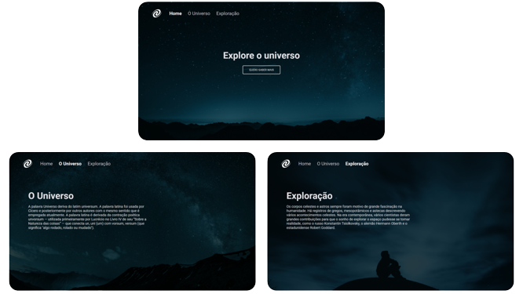

<h1 align="center">Universe ~ SPA</h1>

  

## 🚀 Tecnologias

Esse projeto foi desenvolvido com as seguintes tecnologias:

- HTML e CSS
- Javascript
- Node.js
- Git e Github
- Figma

## 📌 Nota

Para o Javascript funcionar é necessário usar um server local.

## 📸 ScreenShoots

  

## ✏️ Layout

🔗 Link-Figma: https://www.figma.com/file/MZ9a9TLDfK4AiHiwsSCYzg/%5BDesafios-Explorer%5D-SPA-Universe-(Copy)?type=design&node-id=0%3A1&mode=design&t=U5xV3lYf9Ew652sq-1

---

🌌 By Lucas Loopst
